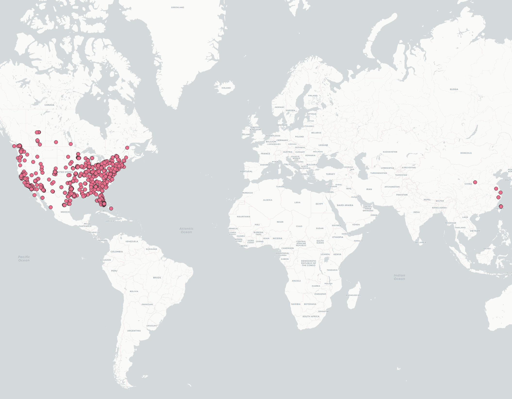

## lab 2
***
**I harvest geotagged data in mainland United States, Canada, and SouthEast China. The data is aquired using crawler aided by Twitter's API. The data is gathered in a period of two mins**
***

***
- Surprisingly, even though Chinese government banned Twitter in China mainland, we can still see some posts with mainland geotag.
- I expect to see more posts with chinese geotag in the daytime *(the data is gathered around midnight)*
- In North America, United States has more users that use geotag than Canada, and most of the users are along the coast line of the continent. 
